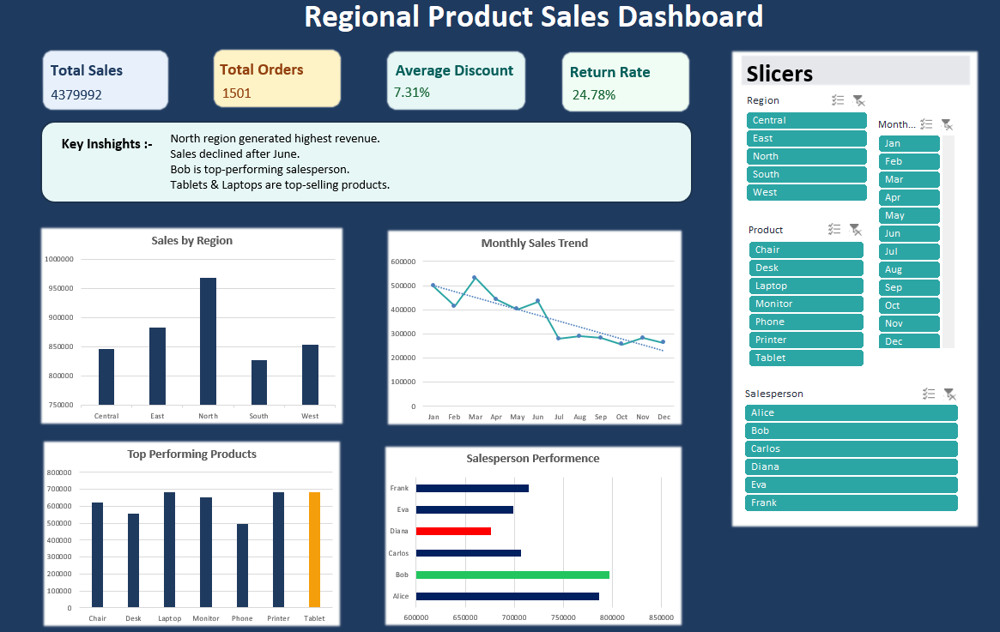
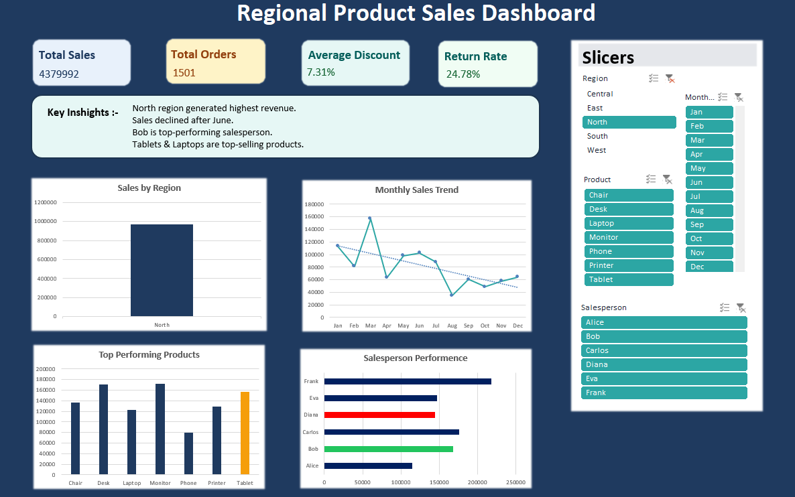
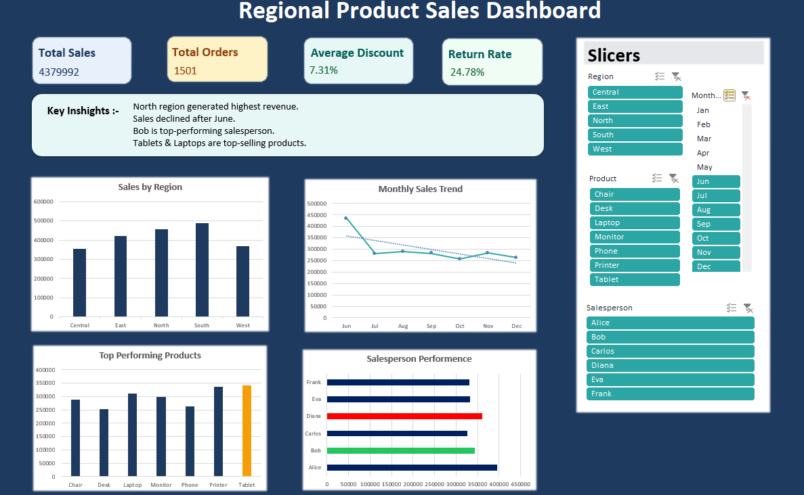
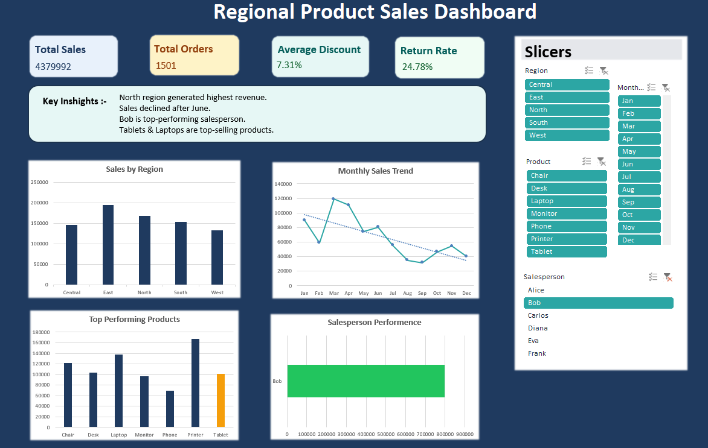
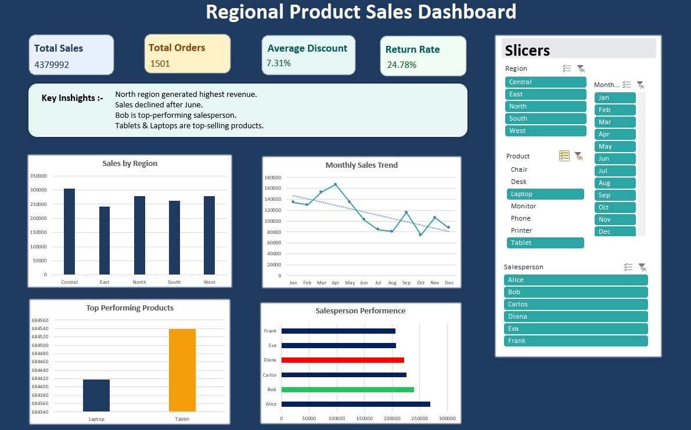

# regional-product-sales-dashboard

This project analyzes regional product sales data and presents insights through an interactive Excel dashboard.

##  Key Insights
- North region generated the highest revenue
- Sales declined after June
- Bob is the top-performing salesperson
- Tablets & Laptops are top-selling products

##  Features
- KPI Cards (Total Sales, Orders, Avg Discount, Return Rate)
- Sales by Region & Monthly Trends
- Product & Salesperson Performance
- Interactive Slicers

##  Tools Used
- Excel
- Pivot Tables
- Pivot Charts
- Data Cleaning

##  Project Screenshots

### Dashboard Overview

### Sales by Region

### Sales Trend

### Salesperson Performance

### Top Products

## Objective
To transform raw sales data into meaningful business insights using Excel.